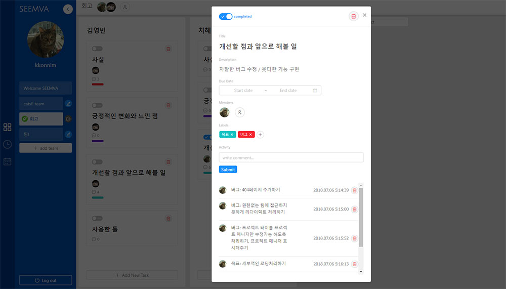

# SEEMVA

> SEEMVA 는 팀 프로젝트 관리 서비스입니다. 팀을 생성하고 팀원을 추가해 프로젝트를 관리해보세요.  
> 프로젝트는 https://seemva.netlify.com/ 에서 확인해보실 수 있습니다.

## 프로젝트 목표

팀을 생성하고 팀원을 추가하여 팀별 프로젝트 / 작업 단위로 관리할 수 있도록 한다.

## 서비스 기능

### 1. 로그인/회원가입

- 사용자는 이름/패스워드/이메일/프로필 사진을 등록해 계정을 생성할 수 있다.(프로필 사진은 생략할 수 있다.)
- 회원가입시 중복 아이디일 경우 안내 메시지를 제공한다.
- 로그인시 이름이나 패스워드가 틀렸을 경우 안내 메시지를 제공한다.
- 로그인하지 않은 사용자는 팀 페이지로 접근할 수 없다.

### 2. 팀(team)

- 팀 생성자는 admin 권한을 부여받고, 팀과 팀 관련 데이터를 완전히 삭제할 수 있다.
- 팀 생성자나 팀원에 의해 초대된 사람은 팀 나가기만 가능하며 팀을 나갈 경우 사용자의 팀 메뉴에서 팀이 삭제된다.
- 팀 초대시 SEEMVA 유저 이름을 키워드로 검색할 수 있다.

### 3. 프로젝트(Project)

- Add New Project 버튼을 클릭시 프로젝트를 생성할 수 있다.
- 프로젝트 생성자는 프로젝트 매니저로 프로젝트의 삭제/수정 권한을 얻는다.

### 4. 작업(task)

- Add New Task 버튼을 클릭하면 프로젝트 이름을 입력해 프로젝트를 생성할 수 있다.
- 작업 카드에서 완료 표시 / 카드 삭제가 가능하다.
- 작업 카드 클릭시 모달을 통해 프로젝트 세부내용을 추가하거나 확일할 수 있다.
- Title / Description / Begin Date / Due Date / Members / Labels 를 수정할 수 있다.

#### 4.1. 작업 멤버(Memebers)

- 팀 멤버만 검색 가능하며 여러명을 작업의 담당자로 지정할 수 있다.

#### 4.2. 작업 라벨(Labels)

- 라벨이름 입력시 이미 등록된 라벨을 선택할 수 있도록 자동완성 기능을 제공한다.
- 새롭게 라벨을 등록하면 컬러를 선택할 수 있다.
- 라벨은 한 작업에 여러개를 등록할 수 있다.

### 5. 활동, 댓글(Activity)

- 사용자는 작업에 활동기록이나 댓글을 Activity 로 생성할 수 있다.
- Activity 를 생성할 경우 입력한 유저의 프로필 / 입력 내용 / 등록 시간을 기록한다.
- Activity 는 입력한 사용자 본인만 수정 삭제가 가능하다.

## 개발 기간

18.06.25 ~ 18.07.06

## 기술 스택 & 툴

### 기획 & 프로토타입

- [카카오 오븐](https://ovenapp.io/view/FroYqk6XSaPnfYK3g5vBrIYKXJpXLRqB/Q6mWO)

### Front-end

- UI libraries
  - react
  - react-router
  - moment
  - classnames
  - [Ant design](https://ant.design/)
- Network
  - axios
- file uploader
  - [uploadcare-widget](https://uploadcare.com/features/widget/)
- convention
  - eslint-plugin-prettier
  - prettier

### Back-end

- Server & Database
  - [fds-json-server](https://www.npmjs.com/package/fds-json-server)

### 환경

- create-react-app 환경 빌드
- uploadcare 의 스토리지, CDN 을 사용해 이미지 저장
- glitch 를 통한 웹 서버 배포
- netlify 를 통한 웹사이트 배포

## 팀원

- [김영빈(akiraei)](https://github.com/akiraei)
- [박치혜(chiabi)](https://github.com/chiabi)

## 협업

- Git, Github
  - [Github projects](https://github.com/geek-ryan/seemva/projects/1)
- [Trello](https://trello.com/b/QNcmQA7U/seemva)
- Slack
  <!-- - [스크럼 보드](https://docs.google.com/spreadsheets/d/e/2PACX-1vSGa15n_Dlm3iafSW2upVNTDyiB-qY9JqVkmO20Jzr3aURdgGKiFA0xOe-q27_AlyFIsXdJouCR3AyY/pubhtml?gid=0&single=true) -->
